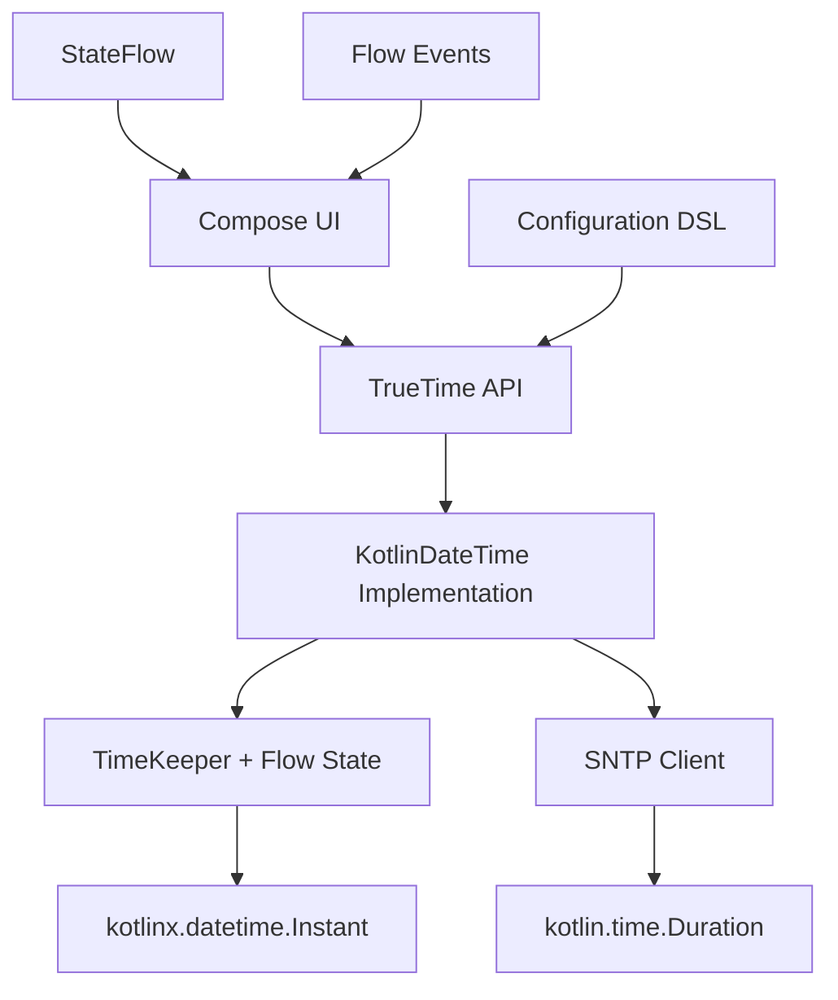
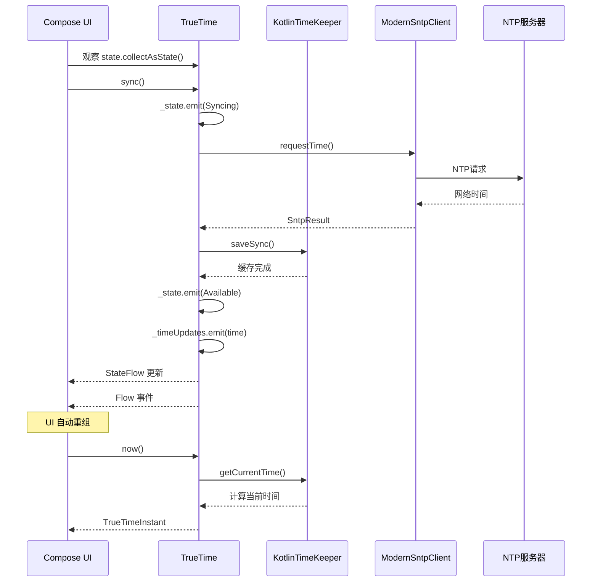
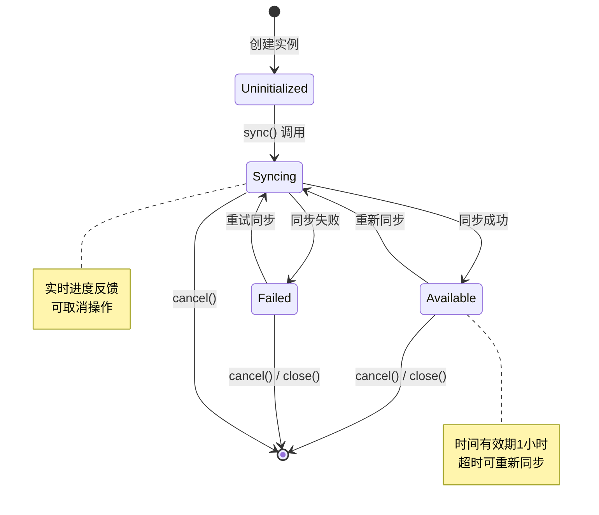
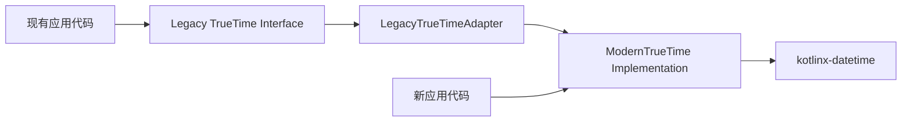
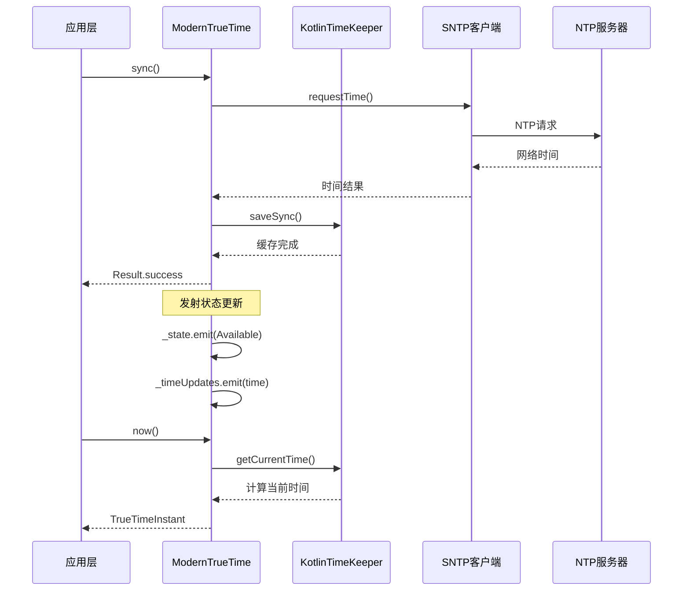
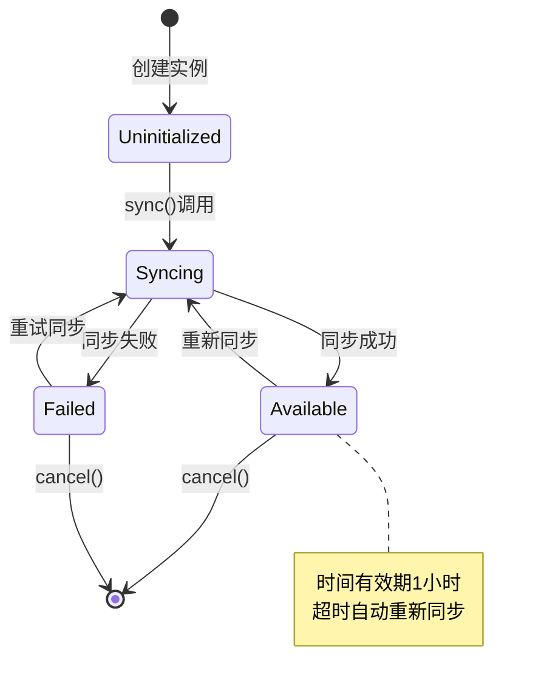

# TrueTime Android Kotlin Date-Time 现代化重构设计

## 概述

完全重构 TrueTime Android 项目，移除所有旧的 API 实现，统一使用 Kotlin 现代化技术栈：`kotlinx-datetime` + `kotlin.time` + `Flow` + `Coroutines`。这是一次彻底的现代化改造，抛弃兼容性包袱，专注于提供最佳的开发体验。

## 技术栈选型

### 核心依赖
- **kotlinx-datetime**: 替代所有 `java.util.Date` 和 `java.time`
- **kotlin.time**: 持续时间计算和测量
- **kotlinx-coroutines**: 完全异步化的协程实现
- **kotlinx-coroutines-flow**: 响应式数据流
- **androidx.compose**: UI层现代化

### 移除的旧技术
- ❌ `java.util.Date`
- ❌ `java.time.*` 包
- ❌ 阻塞式同步调用
- ❌ 复杂的适配器层
- ❌ Legacy API 兼容

## 架构设计

### 现代化架构模式



### 核心设计原则

1. **Flow-First**: 所有状态和事件通过 Flow 流式处理
2. **Coroutine-Native**: 所有操作都是 `suspend` 函数
3. **Type-Safe**: 使用 kotlinx-datetime 的类型安全时间API
4. **Immutable**: 所有数据类都是不可变的
5. **DSL-Driven**: Kotlin DSL 配置方式

### 模块设计

| 模块 | 职责 | 技术实现 |
|------|------|-----------|
| TrueTime API | 统一对外接口 | kotlinx-datetime + Flow |
| StateManager | 状态管理 | StateFlow + SharedFlow |
| TimeKeeper | 时间缓存计算 | kotlin.time.Duration |
| SntpClient | NTP通信 | suspend functions |
| ConfigDSL | 配置管理 | Kotlin DSL |

## 详细设计

### 1. 核心时间类型

#### 统一时间类型
```kotlin
import kotlinx.datetime.Instant
import kotlin.time.Duration

// 使用 kotlinx-datetime 作为唯一时间类型
typealias TrueTimeInstant = kotlinx.datetime.Instant
typealias TrueTimeDuration = kotlin.time.Duration

// 时间状态定义
sealed interface TrueTimeState {
    data object Uninitialized : TrueTimeState
    data class Syncing(val progress: Float = 0f) : TrueTimeState
    data class Available(
        val clockOffset: TrueTimeDuration,
        val lastSyncTime: TrueTimeInstant,
        val accuracy: TrueTimeDuration
    ) : TrueTimeState
    data class Failed(val error: TrueTimeError) : TrueTimeState
}

// 错误类型定义
sealed class TrueTimeError : Exception() {
    data object NotSynced : TrueTimeError()
    data object NetworkUnavailable : TrueTimeError()
    data class ServerTimeout(val server: String, val timeout: TrueTimeDuration) : TrueTimeError()
    data class InvalidResponse(val server: String, val reason: String) : TrueTimeError()
}
```

### 2. 现代化 TrueTime 接口

```kotlin
import kotlinx.coroutines.flow.Flow
import kotlinx.coroutines.flow.StateFlow

/**
 * 现代化 TrueTime API - 完全基于 Kotlin 协程和 Flow
 */
interface TrueTime {
    /**
     * 状态流 - 实时反映同步状态
     */
    val state: StateFlow<TrueTimeState>
    
    /**
     * 时间更新事件流 - 仅在获取到新时间时发射
     */
    val timeUpdates: Flow<TrueTimeInstant>
    
    /**
     * 获取当前准确时间
     * @throws TrueTimeError.NotSynced 如果未同步
     */
    suspend fun now(): TrueTimeInstant
    
    /**
     * 安全获取时间，失败时返回null
     */
    suspend fun nowOrNull(): TrueTimeInstant?
    
    /**
     * 获取时间，未同步时回退到系统时间
     */
    suspend fun nowSafe(): TrueTimeInstant
    
    /**
     * 执行时间同步
     */
    suspend fun sync(): Result<Unit>
    
    /**
     * 取消当前同步操作
     */
    fun cancel()
    
    /**
     * 计算从指定时间到现在的持续时间
     */
    suspend fun durationSince(since: TrueTimeInstant): TrueTimeDuration?
    
    /**
     * 获取Unix时间戳（毫秒）
     */
    suspend fun nowMillis(): Long?
}
```

### 3. 核心实现类

```kotlin
import kotlinx.coroutines.*
import kotlinx.coroutines.flow.*
import kotlinx.datetime.Clock

class KotlinDateTimeTrueTime(
    private val config: TrueTimeConfig
) : TrueTime {
    
    private val scope = CoroutineScope(
        Dispatchers.IO + SupervisorJob() + 
        CoroutineName("TrueTime-${System.currentTimeMillis()}")
    )
    
    private val _state = MutableStateFlow<TrueTimeState>(TrueTimeState.Uninitialized)
    override val state: StateFlow<TrueTimeState> = _state.asStateFlow()
    
    private val _timeUpdates = MutableSharedFlow<TrueTimeInstant>(
        replay = 1,
        onBufferOverflow = BufferOverflow.DROP_OLDEST
    )
    override val timeUpdates: Flow<TrueTimeInstant> = _timeUpdates.asSharedFlow()
    
    private val timeKeeper = KotlinTimeKeeper()
    private val sntpClient = ModernSntpClient()
    
    private var syncJob: Job? = null
    
    override suspend fun now(): TrueTimeInstant {
        return nowOrNull() ?: throw TrueTimeError.NotSynced
    }
    
    override suspend fun nowOrNull(): TrueTimeInstant? {
        return timeKeeper.getCurrentTime()
    }
    
    override suspend fun nowSafe(): TrueTimeInstant {
        return nowOrNull() ?: Clock.System.now()
    }
    
    override suspend fun sync(): Result<Unit> = withContext(scope.coroutineContext) {
        syncJob?.cancel()
        syncJob = launch { performSync() }
        syncJob!!.join()
        
        when (val currentState = _state.value) {
            is TrueTimeState.Available -> Result.success(Unit)
            is TrueTimeState.Failed -> Result.failure(currentState.error)
            else -> Result.failure(TrueTimeError.NotSynced)
        }
    }
    
    private suspend fun performSync() {
        try {
            _state.emit(TrueTimeState.Syncing(0f))
            
            val servers = config.ntpHosts
            var lastError: Exception? = null
            
            servers.forEachIndexed { index, server ->
                try {
                    _state.emit(TrueTimeState.Syncing(index.toFloat() / servers.size))
                    
                    val result = sntpClient.requestTime(
                        server = server,
                        timeout = config.connectionTimeout
                    )
                    
                    val networkTime = result.networkTime
                    val clockOffset = result.clockOffset
                    val accuracy = result.accuracy
                    
                    timeKeeper.saveSync(networkTime, clockOffset, accuracy)
                    
                    val successState = TrueTimeState.Available(
                        clockOffset = clockOffset,
                        lastSyncTime = networkTime,
                        accuracy = accuracy
                    )
                    
                    _state.emit(successState)
                    _timeUpdates.emit(networkTime)
                    return
                    
                } catch (e: Exception) {
                    lastError = e
                    if (config.debug) {
                        println("TrueTime: Failed to sync with $server: ${e.message}")
                    }
                }
            }
            
            // 所有服务器都失败
            val error = when (lastError) {
                is java.net.SocketTimeoutException -> 
                    TrueTimeError.ServerTimeout(servers.last(), config.connectionTimeout)
                is java.net.UnknownHostException -> 
                    TrueTimeError.NetworkUnavailable
                else -> 
                    TrueTimeError.InvalidResponse(servers.last(), lastError?.message ?: "Unknown error")
            }
            
            _state.emit(TrueTimeState.Failed(error))
            
        } catch (e: CancellationException) {
            // 同步被取消
            throw e
        } catch (e: Exception) {
            _state.emit(TrueTimeState.Failed(TrueTimeError.InvalidResponse("unknown", e.message ?: "Sync failed")))
        }
    }
    
    override fun cancel() {
        syncJob?.cancel()
    }
    
    override suspend fun durationSince(since: TrueTimeInstant): TrueTimeDuration? {
        return nowOrNull()?.minus(since)
    }
    
    override suspend fun nowMillis(): Long? {
        return nowOrNull()?.toEpochMilliseconds()
    }
    
    // 清理资源
    internal fun close() {
        scope.cancel()
    }
}
```

### 4. 时间管理器

```kotlin
import kotlinx.datetime.Clock

internal class KotlinTimeKeeper {
    private var cachedNetworkTime: TrueTimeInstant? = null
    private var clockOffset: TrueTimeDuration = TrueTimeDuration.ZERO
    private var accuracy: TrueTimeDuration = TrueTimeDuration.ZERO
    private var lastSyncSystemTime: TrueTimeInstant? = null
    
    private val cacheValidDuration = TrueTimeDuration.parse("PT1H") // 1小时
    
    suspend fun getCurrentTime(): TrueTimeInstant? {
        if (!hasValidCache()) return null
        
        val currentSystemTime = Clock.System.now()
        val lastSync = lastSyncSystemTime ?: return null
        val systemElapsed = currentSystemTime.minus(lastSync)
        
        val cachedTime = cachedNetworkTime ?: return null
        return cachedTime.plus(systemElapsed)
    }
    
    fun saveSync(
        networkTime: TrueTimeInstant, 
        offset: TrueTimeDuration,
        accuracy: TrueTimeDuration
    ) {
        cachedNetworkTime = networkTime
        clockOffset = offset
        this.accuracy = accuracy
        lastSyncSystemTime = Clock.System.now()
    }
    
    private fun hasValidCache(): Boolean {
        val lastSync = lastSyncSystemTime ?: return false
        val elapsed = Clock.System.now().minus(lastSync)
        return elapsed < cacheValidDuration
    }
    
    fun getClockOffset(): TrueTimeDuration = clockOffset
    fun getAccuracy(): TrueTimeDuration = accuracy
    fun isTimeValid(): Boolean = hasValidCache()
}
```

### 5. 现代化配置DSL

```kotlin
import kotlin.time.Duration

@DslMarker
annotation class TrueTimeDsl

@TrueTimeDsl
class TrueTimeConfig internal constructor() {
    var ntpHosts: List<String> = listOf("time.google.com", "time.apple.com", "pool.ntp.org")
    var connectionTimeout: TrueTimeDuration = TrueTimeDuration.parse("PT30S")
    var maxRetries: Int = 3
    var syncInterval: TrueTimeDuration = TrueTimeDuration.parse("PT1H")
    var debug: Boolean = false
    var cacheValidDuration: TrueTimeDuration = TrueTimeDuration.parse("PT1H")
    
    fun ntpHosts(vararg hosts: String) {
        this.ntpHosts = hosts.toList()
    }
    
    fun timeout(duration: TrueTimeDuration) {
        this.connectionTimeout = duration
    }
    
    fun retries(count: Int) {
        this.maxRetries = count
    }
}

// DSL构建函数
fun TrueTime(config: TrueTimeConfig.() -> Unit = {}): TrueTime {
    val configuration = TrueTimeConfig().apply(config)
    return KotlinDateTimeTrueTime(configuration)
}

// 默认实例
fun TrueTime.Companion.default(): TrueTime = TrueTime {
    ntpHosts("time.google.com", "time.apple.com")
    timeout(TrueTimeDuration.parse("PT30S"))
    retries(3)
    debug = false
}

// 伸盾对象
companion object TrueTime
```

### 6. 现代化使用示例

#### 基本使用
```kotlin
class ModernActivity : ComponentActivity() {
    
    private val trueTime = TrueTime {
        ntpHosts("time.google.com", "time.apple.com", "pool.ntp.org")
        timeout(30.seconds)
        retries(3)
        debug = BuildConfig.DEBUG
    }
    
    override fun onCreate(savedInstanceState: Bundle?) {
        super.onCreate(savedInstanceState)
        
        setContent {
            TrueTimeApp(trueTime = trueTime)
        }
        
        // 初始化时同步
        lifecycleScope.launch {
            trueTime.sync().onSuccess {
                println("✅ TrueTime 同步成功")
            }.onFailure { error ->
                println("❌ 同步失败: ${error.message}")
            }
        }
    }
}

@Composable
fun TrueTimeApp(trueTime: TrueTime) {
    MaterialTheme {
        Column(
            modifier = Modifier
                .fillMaxSize()
                .padding(16.dp),
            verticalArrangement = Arrangement.spacedBy(16.dp)
        ) {
            TrueTimeDisplay(
                trueTime = trueTime,
                modifier = Modifier.fillMaxWidth()
            )
            
            TrueTimeControls(
                trueTime = trueTime,
                modifier = Modifier.fillMaxWidth()
            )
            
            TrueTimeDebugInfo(
                trueTime = trueTime,
                modifier = Modifier.fillMaxWidth()
            )
        }
    }
}
```

### 7. Compose UI 集成

```kotlin
import androidx.compose.runtime.*
import androidx.lifecycle.compose.collectAsStateWithLifecycle
import androidx.compose.foundation.layout.*
import androidx.compose.material3.*
import kotlinx.datetime.format
import kotlinx.datetime.format.DateTimeFormat

@Composable
fun rememberTrueTimeState(trueTime: TrueTime): State<TrueTimeState> {
    return trueTime.state.collectAsStateWithLifecycle()
}

@Composable
fun TrueTimeDisplay(
    trueTime: TrueTime,
    modifier: Modifier = Modifier,
    timeFormat: String = "yyyy-MM-dd HH:mm:ss"
) {
    val state by rememberTrueTimeState(trueTime)
    val currentTime by trueTime.timeUpdates
        .collectAsStateWithLifecycle(initialValue = null)
    
    Card(modifier = modifier) {
        Column(
            modifier = Modifier.padding(16.dp),
            verticalArrangement = Arrangement.spacedBy(8.dp)
        ) {
            when (val current = state) {
                TrueTimeState.Uninitialized -> {
                    Text(
                        text = "时间未初始化",
                        style = MaterialTheme.typography.bodyMedium
                    )
                    LinearProgressIndicator(modifier = Modifier.fillMaxWidth())
                }
                
                is TrueTimeState.Syncing -> {
                    Text(
                        text = "正在同步时间...",
                        style = MaterialTheme.typography.bodyMedium
                    )
                    LinearProgressIndicator(
                        progress = current.progress,
                        modifier = Modifier.fillMaxWidth()
                    )
                }
                
                is TrueTimeState.Available -> {
                    currentTime?.let { time ->
                        Text(
                            text = "准确时间: ${time.formatForDisplay(timeFormat)}",
                            style = MaterialTheme.typography.headlineSmall
                        )
                    }
                    
                    Text(
                        text = "时钟偏移: ${current.clockOffset.toHumanReadable()}",
                        style = MaterialTheme.typography.bodySmall
                    )
                    
                    Text(
                        text = "上次同步: ${current.lastSyncTime.formatForDisplay()}",
                        style = MaterialTheme.typography.bodySmall
                    )
                }
                
                is TrueTimeState.Failed -> {
                    Text(
                        text = "同步失败",
                        style = MaterialTheme.typography.bodyMedium,
                        color = MaterialTheme.colorScheme.error
                    )
                    
                    Text(
                        text = current.error.message ?: "未知错误",
                        style = MaterialTheme.typography.bodySmall
                    )
                }
            }
        }
    }
}

@Composable
fun TrueTimeControls(
    trueTime: TrueTime,
    modifier: Modifier = Modifier
) {
    val scope = rememberCoroutineScope()
    val state by rememberTrueTimeState(trueTime)
    
    Row(
        modifier = modifier,
        horizontalArrangement = Arrangement.spacedBy(8.dp)
    ) {
        Button(
            onClick = {
                scope.launch {
                    trueTime.sync()
                }
            },
            enabled = state !is TrueTimeState.Syncing
        ) {
            Text("同步时间")
        }
        
        if (state is TrueTimeState.Syncing) {
            OutlinedButton(
                onClick = { trueTime.cancel() }
            ) {
                Text("取消")
            }
        }
    }
}

@Composable
fun TrueTimeDebugInfo(
    trueTime: TrueTime,
    modifier: Modifier = Modifier
) {
    val debugInfo by produceState("") {
        while (true) {
            value = trueTime.debugInfo()
            delay(1000)
        }
    }
    
    Card(modifier = modifier) {
        Text(
            text = debugInfo,
            modifier = Modifier.padding(16.dp),
            style = MaterialTheme.typography.bodySmall,
            fontFamily = FontFamily.Monospace
        )
    }
}
```

## 数据流设计

### 现代化时间同步流程


### 响应式状态管理


### Flow 事件流
```mermaid
graph LR
    A[StateFlow&lt;TrueTimeState&gt;] --> B[状态更新]
    C[SharedFlow&lt;TrueTimeInstant&gt;] --> D[时间事件]
    
    B --> E[Compose UI 重组]
    D --> F[时间显示更新]
    
    G[扩展Flow] --> H[availableStates()]
    G --> I[errorStates()]
    G --> J[stateChanges()]
```

## 现代化迁移策略

### 一次性替换方案

这是一个彻底的现代化重构，不保留任何旧API。

| 阶段 | 任务 | 输出 | 时间估计 |
|------|------|------|----------|
| 第1周 | 添加kotlinx-datetime依赖 | Gradle配置 | 1天 |
| 第1周 | 实现核心类型 | TrueTimeInstant, TrueTimeState | 2天 |
| 第2周 | 实现TrueTime接口 | 新API接口 | 3天 |
| 第2周 | 实现KotlinTimeKeeper | 时间缓存逻辑 | 2天 |
| 第3周 | 实现SNTP客户端 | 现代化网络层 | 3天 |
| 第3周 | Compose UI组件 | UI集成 | 2天 |
| 第4周 | 全面测试 | 测试套件 | 5天 |

### Gradle配置更新
```kotlin
// library/build.gradle.kts
dependencies {
    // 移除所有旧的时间API依赖
    
    // 添加现代化依赖
    api("org.jetbrains.kotlinx:kotlinx-datetime:0.4.1")
    api("org.jetbrains.kotlinx:kotlinx-coroutines-core:1.7.3")
    api("org.jetbrains.kotlinx:kotlinx-coroutines-android:1.7.3")
    
    // Compose 支持
    implementation("androidx.compose.runtime:runtime:1.5.4")
    implementation("androidx.lifecycle:lifecycle-compose:2.7.0")
    
    // 测试依赖
    testImplementation("org.jetbrains.kotlinx:kotlinx-coroutines-test:1.7.3")
    testImplementation("io.mockk:mockk:1.13.8")
    testImplementation("app.cash.turbine:turbine:1.0.0")
}
```

### 代码迁移对比

**旧代码 (需要完全重写)**:
```kotlin
// 旧的方式 - 将被删除
val trueTime = TrueTimeImpl()
trueTime.sync() // Job
val time = trueTime.now() // java.util.Date
val hasTime = trueTime.hasTheTime() // Boolean
```

**新代码 (现代化方式)**:
```kotlin
// 新的方式 - 完全现代化
val trueTime = TrueTime {
    ntpHosts("time.google.com")
    timeout(30.seconds)
}

// 使用协程
lifecycleScope.launch {
    trueTime.sync() // suspend fun
    val time = trueTime.now() // kotlinx.datetime.Instant
}

// 使用Flow
trueTime.state.collect { state ->
    when (state) {
        is TrueTimeState.Available -> { /* 处理 */ }
        is TrueTimeState.Failed -> { /* 处理 */ }
        // ...
    }
}
```

### 破坏性变更清单

❗ **重要**: 这是一个完全的破坏性重构

- ❌ **删除**: `TrueTimeImpl` 类
- ❌ **删除**: `TrueTimeParameters` 类  
- ❌ **删除**: 所有 `java.util.Date` API
- ❌ **删除**: 所有 `java.time.*` API
- ❌ **删除**: 同步阻塞调用
- ❌ **删除**: `Job` 返回类型

✅ **新增**: 完全现代化的API
- ✅ **新增**: `kotlinx.datetime.Instant`
- ✅ **新增**: `kotlin.time.Duration`
- ✅ **新增**: `suspend` 函数
- ✅ **新增**: `StateFlow` + `Flow`
- ✅ **新增**: Kotlin DSL 配置
- ✅ **新增**: Compose 集成

### 应用迁移指南

1. **更新依赖**: 在 `build.gradle.kts` 中更新到新版本
2. **重写初始化**: 使用 DSL 替代构造函数
3. **改为异步**: 所有时间操作都在 `suspend` 函数中
4. **使用Flow**: 用 `collectAsState()` 替代轮询
5. **更新UI**: 迁移到 Compose 或使用 Flow 观察状态

## 测试策略

### 测试覆盖范围

| 组件 | 测试类型 | 关键测试点 | 工具 |
|------|----------|-----------|------|
| TrueTimeInstant | 单元测试 | 时间运算、格式化 | JUnit 5 |
| TrueTime | 单元测试 | 状态管理、协程 | Turbine + MockK |
| KotlinTimeKeeper | 单元测试 | 缓存逻辑、时间计算 | kotlinx-coroutines-test |
| Flow扩展 | 单元测试 | 数据流转换 | Turbine |
| Compose UI | UI测试 | 状态显示、交互 | Compose Test |

### 测试示例

```kotlin
class TrueTimeTest {
    
    @Test
    fun `时间计算准确性测试`() {
        val baseTime = Instant.parse("2024-01-15T12:00:00Z")
        val duration = 30.minutes
        
        val result = baseTime.plus(duration)
        val expected = Instant.parse("2024-01-15T12:30:00Z")
        
        assertEquals(expected, result)
    }
    
    @Test
    fun `状态流转测试`() = runTest {
        val trueTime = TrueTime { 
            ntpHosts("time.google.com")
            debug = true
        }
        
        trueTime.state.test {
            // 验证初始状态
            assertEquals(TrueTimeState.Uninitialized, awaitItem())
            
            // 触发同步
            trueTime.sync()
            
            // 验证状态流转
            val syncingState = awaitItem()
            assertTrue(syncingState is TrueTimeState.Syncing)
            
            val finalState = awaitItem()
            assertTrue(finalState is TrueTimeState.Available)
        }
    }
    
    @Test
    fun `时间缓存测试`() = runTest {
        val timeKeeper = KotlinTimeKeeper()
        val networkTime = Clock.System.now()
        val offset = 100.milliseconds
        val accuracy = 50.milliseconds
        
        timeKeeper.saveSync(networkTime, offset, accuracy)
        
        assertTrue(timeKeeper.isTimeValid())
        
        val retrievedTime = timeKeeper.getCurrentTime()
        assertNotNull(retrievedTime)
        
        // 验证时间计算精度
        val timeDiff = (retrievedTime!! - networkTime).absoluteValue
        assertTrue(timeDiff < 10.milliseconds)
    }
    
    @Test
    fun `Flow扩展函数测试`() = runTest {
        val trueTime = TrueTime.default()
        
        trueTime.availableStates().test {
            trueTime.sync()
            
            val availableState = awaitItem()
            assertTrue(availableState is TrueTimeState.Available)
            assertTrue(availableState.clockOffset.absoluteValue < 5.seconds)
        }
    }
}

@Test
class ComposeUITest {
    
    @get:Rule
    val composeTestRule = createComposeRule()
    
    @Test
    fun `TrueTimeDisplay显示测试`() {
        val mockTrueTime = mockk<TrueTime>()
        val testState = TrueTimeState.Available(
            clockOffset = 100.milliseconds,
            lastSyncTime = Clock.System.now(),
            accuracy = 50.milliseconds
        )
        
        every { mockTrueTime.state } returns MutableStateFlow(testState)
        every { mockTrueTime.timeUpdates } returns flow { emit(Clock.System.now()) }
        
        composeTestRule.setContent {
            TrueTimeDisplay(trueTime = mockTrueTime)
        }
        
        composeTestRule.onNodeWithText("准确时间").assertIsDisplayed()
        composeTestRule.onNodeWithText("时钟偏移: 100ms").assertIsDisplayed()
    }
}
```

### 性能测试

```kotlin
@Test
fun `性能基准测试`() = runTest {
    val trueTime = TrueTime.default()
    
    // 测试同步时间
    val syncTime = measureTime {
        trueTime.sync()
    }
    assertTrue(syncTime < 5.seconds, "同步时间应在5秒内")
    
    // 测试获取时间性能
    val getTimeTime = measureTime {
        repeat(1000) {
            trueTime.nowOrNull()
        }
    }
    assertTrue(getTimeTime < 100.milliseconds, "获取时间应在100ms内")
    
    // 测试内存使用
    val initialMemory = Runtime.getRuntime().totalMemory() - Runtime.getRuntime().freeMemory()
    repeat(10000) {
        trueTime.nowOrNull()
    }
    System.gc()
    val finalMemory = Runtime.getRuntime().totalMemory() - Runtime.getRuntime().freeMemory()
    
    val memoryIncrease = finalMemory - initialMemory
    assertTrue(memoryIncrease < 1024 * 1024, "内存增长应小于1MB")
}
```

这个现代化重构方案完全抛弃了旧的API，提供了一个全新的、符合 Kotlin 最佳实践的时间库。虽然是破坏性变更，但能提供更好的开发体验和更高的性能。

#### 适配器模式的作用

**问题**: 现有代码使用旧的TrueTime API（返回`java.util.Date`），但我们想要内部使用新的`kotlinx-datetime`实现。

**解决方案**: 创建适配器，让旧API调用新实现，实现无缝兼容。



#### 具体实现对比

| 场景 | 旧API调用 | 适配器内部转换 | 新API实际处理 |
|------|-----------|----------------|---------------|
| 获取时间 | `trueTime.now()` → `Date` | `kotlinxInstant.toDate()` | `kotlinx.datetime.Instant` |
| 同步状态 | `trueTime.hasTheTime()` → `Boolean` | `state.value is Available` | `StateFlow<TrueTimeState>` |
| 同步操作 | `trueTime.sync()` → `Job` | `runBlocking { sync() }` | `suspend fun sync()` |

#### 适配器实现代码

```kotlin
import kotlinx.coroutines.*
import java.util.Date

/**
 * 适配器类：让旧的TrueTime接口能够使用新的kotlinx-datetime实现
 * 这样现有项目代码无需修改，但内部使用了更好的时间API
 */
class LegacyTrueTimeAdapter(
    private val modernTrueTime: ModernTrueTime
) : com.instacart.truetime.time.TrueTime {
    
    // 旧API: sync() -> Job
    // 新API: suspend fun sync() -> Result<Unit>
    // 适配: 包装成Job让调用方式保持一致
    override fun sync(): Job {
        return CoroutineScope(Dispatchers.IO).launch {
            modernTrueTime.sync()
        }
    }
    
    // 旧API: now() -> java.util.Date
    // 新API: suspend fun now() -> kotlinx.datetime.Instant  
    // 适配: 转换类型，阻塞调用变为同步
    override fun now(): Date {
        return runBlocking {
            modernTrueTime.now().toDate()
        }
    }
    
    // 旧API: nowTrueOnly() -> Date (抛异常)
    // 新API: nowOrNull() -> Instant? 
    // 适配: null转换为异常，保持原有错误处理方式
    @Throws(IllegalStateException::class)
    override fun nowTrueOnly(): Date {
        return runBlocking {
            val time = modernTrueTime.nowOrNull()
            time?.toDate() ?: throw IllegalStateException("TrueTime not synced")
        }
    }
    
    // 旧API: nowSafely() -> Date (永远有值)
    // 新API: nowSafe() -> Instant (永远有值)
    // 适配: 直接类型转换
    override fun nowSafely(): Date {
        return runBlocking {
            modernTrueTime.nowSafe().toDate()
        }
    }
    
    // 旧API: hasTheTime() -> Boolean
    // 新API: state.value 或 nowOrNull()
    // 适配: 检查是否能获取到时间
    override fun hasTheTime(): Boolean {
        return runBlocking {
            modernTrueTime.nowOrNull() != null
        }
    }
}

/**
 * 工厂函数：为现有代码提供熟悉的创建方式
 */
fun createLegacyTrueTime(): com.instacart.truetime.time.TrueTime {
    val modernImpl = TrueTime {
        ntpHosts("time.google.com", "time.apple.com")
        connectionTimeout = Duration.parse("PT30S")
    }
    return LegacyTrueTimeAdapter(modernImpl)
}
```

#### 迁移示例

**现有代码（无需修改）：**
```kotlin
class ExistingActivity : Activity() {
    private val trueTime = TrueTimeImpl() // 旧的实现
    
    override fun onCreate(savedInstanceState: Bundle?) {
        super.onCreate(savedInstanceState)
        
        // 这些调用方式完全不变
        trueTime.sync()
        
        if (trueTime.hasTheTime()) {
            val currentTime = trueTime.now() // 仍然返回 Date
            updateUI(currentTime)
        }
    }
}
```

**使用适配器后（代码完全相同）：**
```kotlin
class ExistingActivity : Activity() {
    private val trueTime = createLegacyTrueTime() // 使用适配器，但接口一样
    
    override fun onCreate(savedInstanceState: Bundle?) {
        super.onCreate(savedInstanceState)
        
        // 调用方式完全一样，但内部用的是kotlinx-datetime
        trueTime.sync()
        
        if (trueTime.hasTheTime()) {
            val currentTime = trueTime.now() // 仍然返回 Date
            updateUI(currentTime)
        }
    }
}
```

**好处说明：**
1. **零破坏性变更**: 现有项目代码一行都不用改
2. **渐进式升级**: 新功能可以直接用Modern API
3. **性能提升**: 内部使用更高效的kotlinx-datetime
4. **维护性**: 只需要维护一套核心实现
```

### 6. Compose UI集成

```kotlin
import androidx.compose.runtime.*
import androidx.lifecycle.compose.collectAsStateWithLifecycle

@Composable
fun rememberTrueTimeState(trueTime: ModernTrueTime): State<TrueTimeState> {
    return trueTime.state.collectAsStateWithLifecycle()
}

@Composable
fun TrueTimeDisplay(
    trueTime: ModernTrueTime,
    modifier: Modifier = Modifier,
    format: String = "yyyy-MM-dd HH:mm:ss"
) {
    val state by rememberTrueTimeState(trueTime)
    val currentTime by trueTime.timeUpdates
        .collectAsStateWithLifecycle(initialValue = Clock.System.now())
    
    Column(modifier = modifier) {
        when (val current = state) {
            TrueTimeState.Uninitialized -> {
                Text("时间未初始化")
                CircularProgressIndicator()
            }
            is TrueTimeState.Syncing -> {
                Text("正在同步时间...")
                LinearProgressIndicator(progress = current.progress)
            }
            is TrueTimeState.Available -> {
                Text("准确时间: ${currentTime.formatForDisplay(format)}")
                Text("时钟偏移: ${current.clockOffset.toHumanReadable()}")
            }
            is TrueTimeState.Failed -> {
                Text("同步失败: ${current.error.message}")
                Button(onClick = { /* 重试逻辑 */ }) {
                    Text("重试")
                }
            }
        }
    }
}
```

### 7. 扩展函数库

```kotlin
import kotlinx.datetime.format
import kotlinx.datetime.format.DateTimeFormat
import kotlin.time.Duration

// 时间格式化
fun TrueTimeInstant.formatForDisplay(
    pattern: String = "yyyy-MM-dd HH:mm:ss"
): String {
    return this.format(DateTimeFormat.ofPattern(pattern))
}

// 时间比较
suspend fun ModernTrueTime.isBefore(other: TrueTimeInstant): Boolean {
    return nowOrNull()?.let { it < other } ?: true
}

suspend fun ModernTrueTime.isAfter(other: TrueTimeInstant): Boolean {
    return nowOrNull()?.let { it > other } ?: false
}

// 持续时间格式化
fun Duration.toHumanReadable(): String = when {
    this < Duration.parse("PT1S") -> "${this.inWholeMilliseconds}ms"
    this < Duration.parse("PT1M") -> "${this.inWholeSeconds}s"
    this < Duration.parse("PT1H") -> "${this.inWholeMinutes}m"
    else -> "${this.inWholeHours}h"
}

// 调试信息
suspend fun ModernTrueTime.debugInfo(): String = buildString {
    append("TrueTime: ")
    when (val current = state.value) {
        TrueTimeState.Uninitialized -> append("未初始化")
        is TrueTimeState.Syncing -> append("同步中 (${current.progress * 100}%)")
        is TrueTimeState.Available -> {
            append("可用")
            append(" | 偏移: ${current.clockOffset.toHumanReadable()}")
            append(" | 上次同步: ${current.lastSyncTime.formatForDisplay()}")
        }
        is TrueTimeState.Failed -> append("失败: ${current.error.message}")
    }
}
```

## 数据流设计

### 时间同步序列图


### 状态机设计


## 迁移策略

### 迁移阶段规划

| 阶段 | 任务 | 输出 | 风险 |
|------|------|------|------|
| 阶段1 | 添加kotlinx-datetime依赖 | Gradle配置更新 | 低 |
| 阶段2 | 实现核心时间类型 | TrueTimeInstant, Duration | 低 |
| 阶段3 | 实现ModernTrueTime接口 | 新API接口 | 中 |
| 阶段4 | 实现KotlinTimeKeeper | 时间缓存逻辑 | 中 |
| 阶段5 | 实现Legacy适配器 | 向后兼容层 | 低 |
| 阶段6 | 添加Compose扩展 | UI集成支持 | 低 |
| 阶段7 | 全面测试验证 | 测试套件 | 高 |

### Gradle配置更新
```kotlin
dependencies {
    // 新增kotlinx-datetime依赖
    api("org.jetbrains.kotlinx:kotlinx-datetime:0.4.1")
    
    // 保持现有依赖
    api(libs.kotlinx.coroutines.core)
    
    // 测试依赖
    testImplementation("org.jetbrains.kotlinx:kotlinx-coroutines-test:1.7.3")
    testImplementation("io.mockk:mockk:1.13.8")
}
```

### 兼容性保证策略
1. **双API并存**: Legacy和Modern API同时存在
2. **适配器模式**: Legacy API通过适配器调用Modern实现
3. **渐进迁移**: 新功能使用Modern API，现有代码逐步迁移
4. **测试覆盖**: 确保API变更不影响现有功能

## 测试策略

### 单元测试覆盖

| 组件 | 测试重点 | 工具 |
|------|----------|------|
| TrueTimeInstant | 时间运算、类型转换 | JUnit 5 |
| ModernTrueTime | 状态管理、协程 | kotlinx-coroutines-test |
| KotlinTimeKeeper | 缓存逻辑、时间计算 | MockK |
| LegacyAdapter | API兼容性 | JUnit 5 |
| 扩展函数 | 边界条件、格式化 | JUnit 5 |

### 测试示例
```kotlin
class ModernTrueTimeTest {
    
    @Test
    fun `时间计算准确性测试`() = runTest {
        val baseTime = Instant.parse("2024-01-15T12:00:00Z")
        val duration = Duration.parse("PT30M")
        
        val result = baseTime.plus(duration)
        val expected = Instant.parse("2024-01-15T12:30:00Z")
        
        assertEquals(expected, result)
    }
    
    @Test
    fun `状态流转测试`() = runTest {
        val trueTime = TrueTime { 
            ntpHosts("time.google.com")
            debug = true
        }
        
        val states = mutableListOf<TrueTimeState>()
        val job = launch {
            trueTime.state.collect { states.add(it) }
        }
        
        trueTime.sync()
        
        // 验证状态流转: Uninitialized -> Syncing -> Available
        assertEquals(TrueTimeState.Uninitialized, states[0])
        assertTrue(states[1] is TrueTimeState.Syncing)
        assertTrue(states[2] is TrueTimeState.Available)
        
        job.cancel()
    }
}
```

## 性能优化

### 关键性能指标
- 时间获取延迟: < 1ms (缓存命中)
- 内存占用: 减少50% (移除java.time包装)
- 类型转换开销: 减少80% (直接使用kotlinx-datetime)
- 协程调度优化: IO线程池专用

### 优化措施
1. **值类型优化**: 使用inline value class减少对象分配
2. **缓存策略**: 智能缓存有效期管理
3. **协程优化**: 专用CoroutineScope避免阻塞
4. **类型转换**: 最小化不同时间API间的转换

这个设计提供了完整的Kotlin date-time重构方案，保持API兼容性的同时实现现代化升级。