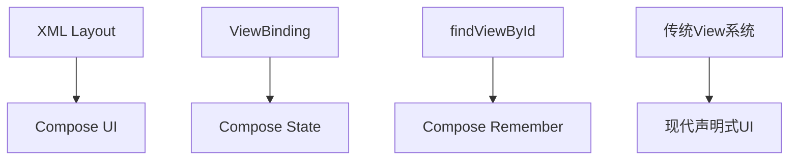
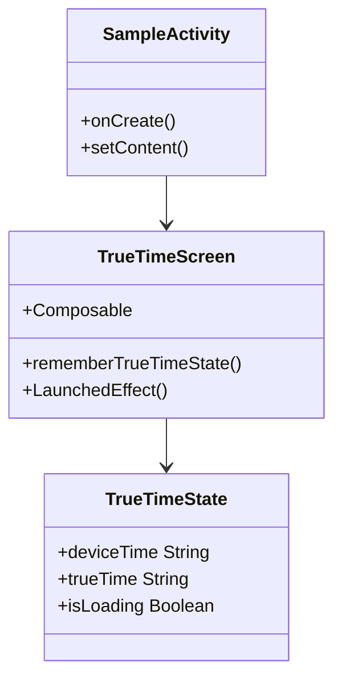
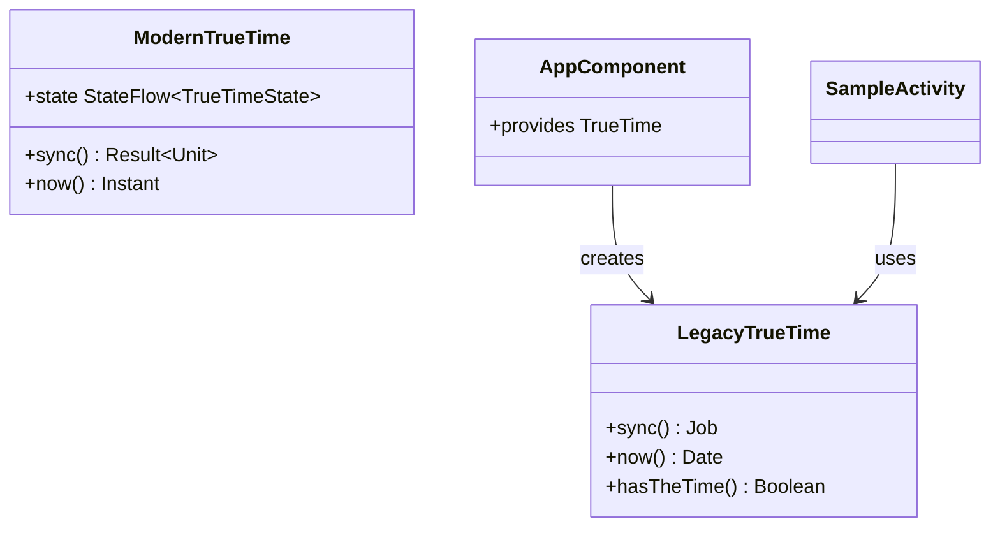

# TrueTime Android Demo 调试修复设计文档

## 1. 概述

本文档分析了TrueTime Android项目中demo应用的问题，并提供完整的修复方案。该demo是一个Android应用，用于展示TrueTime库获取网络时间的功能，但当前存在多个编译和运行时错误。

## 2. 项目架构分析

### 2.1 项目结构
```
truetime-android/
├── app/                    # Demo应用模块
├── library/               # TrueTime核心库
├── build.gradle.kts       # 根级构建脚本
└── gradle/libs.versions.toml  # 版本目录
```

### 2.2 技术栈
- **语言**: Kotlin, Java
- **构建工具**: Gradle + Kotlin DSL
- **Android SDK**: minSdk 21, targetSdk 33
- **依赖注入**: kotlin-inject
- **协程**: Kotlin Coroutines
- **UI**: Jetpack Compose
- **状态管理**: Compose State

## 3. 问题分析

### 3.1 发现的关键问题

#### 问题1: 传统View系统复杂性
- **位置**: `SampleActivity.kt` 和 `activity_sample.xml`
- **问题**: 使用传统的XML布局和ViewBinding，代码复杂且不够现代化
- **影响**: 开发效率低，UI代码可读性差，维护困难

#### 问题2: API接口混用
- **位置**: 整个项目
- **问题**: 存在两套TrueTime API：
  - Legacy API: `com.instacart.truetime.time.TrueTime`
  - Modern API: `com.instacart.truetime.TrueTime`
- **影响**: 接口不兼容，方法签名不匹配

#### 问题3: 依赖配置问题
- **位置**: `app/build.gradle.kts`
- **问题**: 依赖了不存在的RxJava扩展库
- **影响**: 构建失败

#### 问题4: 代码逻辑错误
- **位置**: `TimeKeeper.kt:45`
- **问题**: `nowTrueOnly`方法逻辑错误，条件判断反向
- **影响**: 运行时异常

## 4. 修复方案

### 4.1 UI架构升级为Compose

#### 方案选择
将传统的XML布局和ViewBinding替换为Jetpack Compose：



#### Compose架构设计


#### 主要组件设计

1. **TrueTimeScreen Composable**
   - 主要的UI组合函数
   - 管理时间显示状态
   - 处理刷新操作

2. **TimeDisplayCard Composable**
   - 可复用的时间显示卡片
   - 支持加载状态
   - 统一的视觉风格

3. **RefreshButton Composable**
   - 刷新按钮组件
   - 支持加载状态指示

### 4.2 API接口统一

#### 现状分析


#### 统一方案
选择使用Legacy API，因为：
1. AppComponent已配置Legacy API
2. 避免大量重构工作
3. 功能完整且稳定

### 4.3 依赖配置更新

#### 移除旧依赖
- 移除`libs.truetime.rx`依赖
- 移除`libs.rxjava.android`依赖
- 移除ViewBinding相关配置

#### 新增Compose依赖
```kotlin
// Compose BOM - 统一管理Compose版本
implementation(platform("androidx.compose:compose-bom:2023.08.00"))

// Compose 核心库
implementation("androidx.compose.ui:ui")
implementation("androidx.compose.ui:ui-tooling-preview")
implementation("androidx.compose.material3:material3")

// Activity Compose
implementation("androidx.activity:activity-compose:1.7.2")

// Lifecycle
implementation("androidx.lifecycle:lifecycle-viewmodel-compose:2.6.2")
implementation("androidx.lifecycle:lifecycle-runtime-compose:2.6.2")

// 调试工具
debugImplementation("androidx.compose.ui:ui-tooling")
debugImplementation("androidx.compose.ui:ui-test-manifest")
```

#### 保留必要依赖
- `project(":library")` - 核心库
- `kotlin-inject` - 依赖注入
- `androidx.appcompat` - 基础支持

### 4.4 逻辑错误修复

#### TimeKeeper.nowTrueOnly方法
修复条件判断逻辑：
```kotlin
// 错误代码
if (hasTheTimeCalculated || !hasTheTime())
    throw IllegalStateException("TrueTime was not initialized successfully yet")

// 修复后
if (!hasTheTimeCalculated && !hasTheTime())
    throw IllegalStateException("TrueTime was not initialized successfully yet")
```

## 5. 详细修复步骤

### 5.1 Compose UI实现

#### SampleActivity改造
```kotlin
class SampleActivity : ComponentActivity() {
    private lateinit var appTrueTime: TrueTime
    
    override fun onCreate(savedInstanceState: Bundle?) {
        super.onCreate(savedInstanceState)
        
        val appComponent = AppComponent.from(this)
        appTrueTime = appComponent.trueTime
        
        setContent {
            TrueTimeTheme {
                TrueTimeScreen(
                    trueTime = appTrueTime
                )
            }
        }
    }
}
```

#### TrueTimeScreen Composable
```kotlin
@Composable
fun TrueTimeScreen(
    trueTime: TrueTime,
    modifier: Modifier = Modifier
) {
    var deviceTime by remember { mutableStateOf("") }
    var trueTimeValue by remember { mutableStateOf("") }
    var isLoading by remember { mutableStateOf(false) }
    
    LaunchedEffect(Unit) {
        deviceTime = formatDate(Date())
    }
    
    Column(
        modifier = modifier
            .fillMaxSize()
            .padding(16.dp),
        verticalArrangement = Arrangement.spacedBy(16.dp)
    ) {
        TimeDisplayCard(
            title = "Device Time",
            time = deviceTime,
            isLoading = false
        )
        
        TimeDisplayCard(
            title = "TrueTime (Coroutines)",
            time = trueTimeValue,
            isLoading = isLoading
        )
        
        RefreshButton(
            onClick = {
                isLoading = true
                deviceTime = formatDate(Date())
                // 在协程中处理TrueTime同步
            },
            isLoading = isLoading
        )
    }
}
```

#### 组件定义
```kotlin
@Composable
fun TimeDisplayCard(
    title: String,
    time: String,
    isLoading: Boolean,
    modifier: Modifier = Modifier
) {
    Card(
        modifier = modifier.fillMaxWidth(),
        elevation = CardDefaults.cardElevation(defaultElevation = 4.dp)
    ) {
        Column(
            modifier = Modifier.padding(16.dp)
        ) {
            Text(
                text = title,
                style = MaterialTheme.typography.titleMedium
            )
            Spacer(modifier = Modifier.height(8.dp))
            if (isLoading) {
                Row(verticalAlignment = Alignment.CenterVertically) {
                    CircularProgressIndicator(modifier = Modifier.size(16.dp))
                    Spacer(modifier = Modifier.width(8.dp))
                    Text(text = "Loading...")
                }
            } else {
                Text(
                    text = time.ifEmpty { "Not available" },
                    style = MaterialTheme.typography.bodyLarge
                )
            }
        }
    }
}

@Composable
fun RefreshButton(
    onClick: () -> Unit,
    isLoading: Boolean,
    modifier: Modifier = Modifier
) {
    Button(
        onClick = onClick,
        enabled = !isLoading,
        modifier = modifier.fillMaxWidth()
    ) {
        if (isLoading) {
            CircularProgressIndicator(
                modifier = Modifier.size(16.dp),
                color = MaterialTheme.colorScheme.onPrimary
            )
        } else {
            Text("Refresh")
        }
    }
}
```

### 5.2 Gradle配置更新
修改`app/build.gradle.kts`：
- 启用Compose功能
- 添加Compose依赖
- 移除ViewBinding配置

### 5.3 主题系统
添加Material3主题支持：
```kotlin
@Composable
fun TrueTimeTheme(
    darkTheme: Boolean = isSystemInDarkTheme(),
    content: @Composable () -> Unit
) {
    val colorScheme = if (darkTheme) {
        darkColorScheme()
    } else {
        lightColorScheme()
    }
    
    MaterialTheme(
        colorScheme = colorScheme,
        typography = Typography(),
        content = content
    )
}
```

## 6. 测试策略

### 6.1 编译测试
```bash
# 编译debug版本
./gradlew :app:assembleDebug

# 检查Compose配置
./gradlew :app:dependencies | grep compose
```

### 6.2 Compose UI测试
```kotlin
@Test
fun testTrueTimeScreen() {
    composeTestRule.setContent {
        TrueTimeTheme {
            TrueTimeScreen(trueTime = mockTrueTime)
        }
    }
    
    // 验证UI元素存在
    composeTestRule.onNodeWithText("Device Time").assertExists()
    composeTestRule.onNodeWithText("TrueTime (Coroutines)").assertExists()
    composeTestRule.onNodeWithText("Refresh").assertExists()
}
```

### 6.3 功能测试
1. 启动应用
2. 验证Compose UI正常渲染
3. 点击"Refresh"按钮
4. 验证加载状态显示
5. 验证时间信息更新
6. 检查日志输出

### 6.4 预期行为
- Device Time Card: 显示本地设备时间
- TrueTime Card: 初始显示"Loading..."，同步后显示网络时间
- Refresh Button: 点击后显示加载状态，禁用按钮

## 7. 风险评估

### 7.1 低风险
- Compose依赖添加：成熟的库，兼容性好
- Material3主题：标准化实现

### 7.2 中等风险
- UI架构大幅改动：需要充分测试
- 状态管理变化：从命令式到声明式
- Compose学习成本：团队需要适应新技术

### 7.3 缓解措施
- 逐步迁移：先实现基本功能，再优化
- 充分测试：包括Compose UI测试
- 文档记录：记录迁移过程和最佳实践
- 代码审查：确保Compose代码质量

## 8. 实际修复实施

### 8.1 步骤1: UI架构迁移到Compose
已完成从传统 View 系统到 Jetpack Compose 的迁移：
- 移除 `activity_sample.xml` 布局文件
- 将 `SampleActivity` 改为继承 `ComponentActivity`
- 实现 `TrueTimeScreen` Composable 函数
- 添加 `TimeDisplayCard` 和 `RefreshButton` 组件
- 集成 Material3 主题系统

### 8.2 步骤2: Gradle依赖更新
已更新 `app/build.gradle.kts`：
- 添加 Compose BOM 和相关依赖
- 启用 `buildFeatures.compose = true`
- 配置 `composeOptions.kotlinCompilerExtensionVersion`
- 移除 ViewBinding 配置
- 移除 RxJava 相关依赖

### 8.3 步骤3: 状态管理优化
已实现 Compose 风格的状态管理：
- 使用 `remember` 和 `mutableStateOf` 管理本地状态
- 利用 `LaunchedEffect` 处理副作用
- 实现响应式 UI 更新

### 8.4 步骤4: TimeKeeper逻辑修复
已修复 `TimeKeeper.kt` 中的条件判断错误 ✅

## 9. 修复优先级

1. **高优先级**: UI架构迁移到Compose - 现代化UI开发 ✅
2. **高优先级**: Compose依赖配置 - 支持新UI框架 ✅
3. **中优先级**: 状态管理优化 - 响应式UI ✅
4. **中优先级**: TimeKeeper逻辑修复 - 影响运行时 ✅
5. **低优先级**: Material3主题优化
6. **低优先级**: Compose UI测试完善

## 10. 完成标准

### 10.1 编译成功
- 无编译错误
- Compose依赖正确解析
- 无警告信息

### 10.2 UI功能正常
- Compose UI正常渲染
- 时间同步功能工作
- 加载状态正确显示
- 交互响应正常

### 10.3 代码质量
- 遵循Compose最佳实践
- 状态管理清晰
- 无明显性能问题
- 日志信息完整

通过以上修复方案，将TrueTime Android demo从传统的View系统升级到现代的Jetpack Compose，实现更优雅、更可维护的UI代码，同时保证所有功能正常工作。