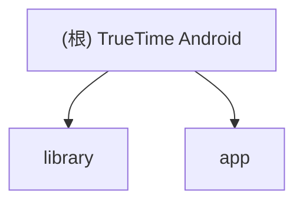

# TrueTime Android - 现代化时间同步库

## 项目愿景

TrueTime Android 是一个完全现代化的 NTP 客户端库，提供准确可靠的网络时间同步功能。该项目完全基于 Kotlin 协程、Flow 和 kotlinx-datetime 构建，取代了传统的 Java 时间 API，为 Android 应用提供类型安全、响应式的时间管理解决方案。

## 架构总览



## 模块索引

| 模块 | 路径 | 职责 | 语言 |
|------|------|------|------|
| library | `:library` | 核心时间同步库，提供 NTP 客户端功能 | Kotlin |
| app | `:app` | 示例应用，展示库的使用方式 | Kotlin + Compose |

## 运行与开发

### 环境要求
- Android Studio 或 IntelliJ IDEA
- JDK 17+
- Android SDK 34+
- Gradle 8.0+

### 构建项目
```bash
./gradlew build
```

### 运行示例应用
```bash
./gradlew :app:installDebug
```

### 发布库
```bash
./gradlew :library:publishReleasePublicationToMavenLocal
```

## 测试策略

- **单元测试**: 核心逻辑测试
- **集成测试**: NTP 服务器通信测试
- **UI 测试**: 示例应用界面测试

## 编码规范

- 遵循 Kotlin 官方编码规范
- 使用 ktlint 进行代码格式化
- 所有公共 API 必须包含 KDoc 文档
- 使用协程和 Flow 进行异步编程
- 优先使用 kotlinx-datetime 而非 Java 时间 API

## AI 使用指引

- 代码生成：可用于生成样板代码和测试用例
- 文档编写：协助编写 API 文档和 README
- 代码审查：检查代码质量和最佳实践
- 重构建议：提供现代化重构建议

## 变更记录 (Changelog)

### 2025-08-28 16:52:33
- 初始化项目 AI 上下文文档
- 创建根级 CLAUDE.md 文件
- 识别并创建模块级文档
- 生成项目结构图

---

*本文件由 Claude Code 自动生成，最后更新于 2025-08-28 16:52:33*